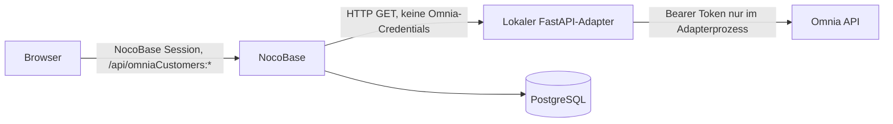

# Architektur

## Zielbild



Der Browser kennt weder die Omnia-Adresse noch die Adapter-Adresse. Das eigene
Plugin stellt zwei authentifizierte NocoBase-Actions bereit:

- `POST /api/omniaCustomers:search` mit Suchtext im Request-Body
- `POST /api/omniaCustomers:summary` mit Kunden-ID im Request-Body

Nur der serverseitige Plugin-Teil ruft den vorhandenen Adapter auf:

- `GET /customers/search?q=...`
- `GET /customers/{customer_id}/summary`

## Sicherheitsgrenzen

- Das Plugin implementiert ausschließlich GET-Lesezugriffe.
- Die beiden NocoBase-Actions sind nur für angemeldete Benutzer freigegeben.
- Omnia-Token und Login-Daten bleiben im FastAPI-Adapter und werden nicht an
  NocoBase übergeben.
- Suchbegriffe, Kunden-IDs, Antwortkörper und Authorization-Header werden vom
  Plugin nicht geloggt.
- Adapter-Antworten werden nur für die aktuelle Anfrage gehalten und nicht in
  PostgreSQL gespeichert.
- Adapterfehler werden auf generische Fehlercodes reduziert. Upstream-Inhalte
  werden weder an den Browser noch in Logs kopiert.
- `OMNIA_ADAPTER_URL` akzeptiert nur HTTP(S)-URLs ohne eingebettete Credentials.

## Versionsentscheidung

Stand 15. Juli 2026 ist `2.1.25` die aktuelle stabile NocoBase-Version. Dieser
erste Slice bleibt bewusst auf `2.0.60`, weil das Plugin gegen die stabile
v1-Client-API gebaut und getestet wird. Die Migration auf 2.1 samt neuer CLI
und client-v2 erfolgt als eigener, verifizierter Schritt. Die offizielle
Dokumentation empfiehlt Docker für Self-Hosting und einen festen Versions-Tag
für produktionsnahe Installationen.

Ein eigenes Full-Stack-Plugin ist mit der Community Edition möglich: Der
Serverteil registriert eigene Resource-Actions, der Clientteil eine React-Seite.
Damit ist der kostenpflichtige REST-Datenquellen-Connector für diesen Slice nicht
erforderlich.

## Lokaler Start

1. `.env.example` nach `.env` übertragen und alle Platzhalter ersetzen.
2. `docker compose build` ausführen.
3. `docker compose up -d` ausführen.
4. Das Plugin aktivieren: `docker compose exec app yarn pm enable @omnia/plugin-customer-search`.
5. Den App-Container einmal neu starten: `docker compose restart app`.
6. `http://localhost:13000/omnia/customers` öffnen und anmelden.

Die direkte Plugin-URL ist für diesen ersten Slice der bewusste Einstieg. Ein
NocoBase-Menüeintrag folgt zusammen mit der internen Rollen- und
Berechtigungskonfiguration vor dem Einsatz gegen Live-Omnia.

Der Standard-Stack startet den echten FastAPI-Adapter als internen Sidecar. Sein
Upstream ist ein rein synthetisches Fixture, damit Treffer- und Detailzustände
ohne Live-Omnia, echte Tokens oder personenbezogene Daten getestet werden. Für
Live-Betrieb wird nur die Adapter-Upstream-Konfiguration ersetzt; der Browser
bleibt weiterhin auf NocoBase beschränkt.

## Verifikation

```sh
node --test packages/plugins/@omnia/plugin-customer-search/test/*.test.js
docker compose --env-file .env.example config --quiet
docker compose exec -T adapter python -c "import urllib.request; urllib.request.urlopen('http://127.0.0.1:8890/health').read()"
```

Für den End-to-End-Test: Suche mit einem freigegebenen Testkunden durchführen,
einen Treffer öffnen und parallel Browser-Netzwerk sowie NocoBase-Logs prüfen.
Im Browser dürfen nur NocoBase-Requests erscheinen. Logs dürfen weder Suchtext,
Kunden-ID, Kundendaten noch Token enthalten.

Der synthetische Compose-Stack kann wiederholbar in Desktop- und Mobilgröße
geprüft werden:

```sh
set -a
. ./.env
set +a
yarn test:e2e:omnia
```

## Nächste Schritte

1. Plugin-Actions explizit auf eine interne NocoBase-Rolle beschränken und erst
   danach den synthetischen Upstream durch Live-Omnia ersetzen.
2. Health- und Timeout-Metriken ohne Request- oder Kundendaten ergänzen.
3. Backup, Upgrade und Restore für PostgreSQL und NocoBase dokumentieren und testen.
4. NocoBase 2.1 und client-v2 in einem getrennten Upgrade-Slice migrieren.

## Offizielle Quellen

- [Docker-Installation](https://docs.nocobase.com/get-started/installation/docker)
- [Plugin-Projektstruktur](https://docs.nocobase.com/plugin-development/project-structure)
- [Serverseitige Plugin-Entwicklung](https://docs.nocobase.com/plugin-development/server)
- [ResourceManager](https://docs.nocobase.com/plugin-development/server/resource-manager)
- [Client-Router](https://docs.nocobase.com/plugin-development/client/router)
- [NocoBase Releases](https://github.com/nocobase/nocobase/releases)
